# Navigation flow

How screens connect and how routing is implemented. This is a companion to the per-screen docs in `docs/screens/` — those describe a screen's elements, this describes how you get between them.

## Routing implementation

- Router: `go_router` (`GoRouter`, configured in `lib/main.dart`).
- Auth screens (`/login`, `/signup`, `/confirm-signup`, `/forgot-password`) are top-level `GoRoute`s outside the shell. Real AWS Cognito auth via `auth_api`'s `AuthController` — `AuthController.configure()` runs once in `main()` before `runApp`, and `AuthController.instance.restore()` is part of Splash's `appReady` future, which then routes to `/dashboard` or `/login` depending on whether a session was restored (see [splash_screen.md](splash/splash_screen.md)).
- The four main sections (`/dashboard`, `/alerts`, `/events`, `/account`) are children of a `StatefulShellRoute.indexedStack`, rendered inside [MainShell](shell/main_shell.md) (`lib/screens/shell/main_shell.dart`). Each branch keeps its own navigation stack — switching tabs does not reset a branch's stack, and returning to a previously-visited tab restores where you left off.
- `CameraLiveScreen` and its settings sub-tree (`/dashboard/live/:cameraId/...`) are nested as a child route of the Dashboard branch's `GoRoute`, alongside `homes/manage` and `ScannedDevicesScreen.routeName` — so it renders inside `MainShell` and the bottom nav bar stays visible throughout, including every Camera Settings sub-screen. The fullscreen landscape video view (LIVE-008) is the one exception: it's pushed via `Navigator.of(context, rootNavigator: true)`, escaping above `MainShell` so the bottom bar is correctly hidden there.
- Leaving `CameraLiveScreen` or any dirty Camera Settings sub-screen via a bottom-nav tap is guarded the same way as the back gesture — see [main_shell.md](shell/main_shell.md)'s `NavigationGuardController` note and `lib/widgets/navigation_leave_guard.dart`.
- Navigate with `context.go('/path ')` (replaces current location, no back-stack entry) for top-level transitions like auth → dashboard. Use `navigationShell.goBranch(index)` for bottom-nav taps (handled inside `MainShell`, not called directly by feature screens).
- All sub-screens under `CameraSettingsScreen` receive the `Camera` via `state.extra`; several also take `homesController` directly as a route-builder constructor param (not through `extra`) since it's a stable singleton — see the Notes section below for which.

## Flow diagram

```mermaid
flowchart TD
    Login["/login\nLoginScreen"] -->|"Sign up link"| Signup["/signup\nSignupScreen"]
    Signup -->|"Log in link"| Login
    Login -->|"successful signIn()"| Shell
    Login -->|"Forgot password? link"| Forgot["/forgot-password\nForgotPasswordScreen"]
    Forgot -->|"reset succeeds / Back to log in"| Login
    Login -->|"UserNotConfirmedException"| Confirm["/confirm-signup\nConfirmSignupScreen"]
    Signup -->|"successful signUp()"| Confirm
    Confirm -->|"confirmSignUp() + signIn() succeed"| Shell
    Confirm -->|"Back to log in"| Login

    subgraph Shell["MainShell — bottom NavigationBar"]
        direction LR
        Dashboard["/dashboard\nDashboardScreen"]
        Alerts["/alerts\nAlertsScreen"]
        Events["/events\nEventsScreen"]
        Account["/account\nAccountScreen\n(tab label: 'Profile')"]
        Dashboard <--> Alerts <--> Events <--> Account
    end

    Alerts -->|"tap a notification"| AlertDetail["/alerts/detail\nAlertDetailScreen"]
    AlertDetail -->|"back"| Alerts
    AlertDetail -->|"tap an 'Unread motion' related card"| Alerts
    AlertDetail -->|"'View live' button (cross-branch)"| Live
    Events -->|"tap an event"| EventDetail["/events/detail\nEventDetailScreen"]
    EventDetail -->|"back"| Events
    EventDetail -->|"'View live' button (cross-branch)"| Live

    Dashboard -->|"home dropdown → Manage homes"| ManageHomes["/dashboard/homes/manage\nManageHomesScreen"]
    ManageHomes -->|"back"| Dashboard

    Dashboard -->|"Add camera AppBar button → scanning popup → auto-navigate"| Scan["/dashboard/scan\nScannedDevicesScreen"]
    Scan -->|"camera added / back"| Dashboard

    Dashboard -->|"tap a camera tile"| Live["/dashboard/live/:cameraId\nCameraLiveScreen\n(nested in Dashboard branch, bottom nav visible)"]
    Live -->|"back"| Dashboard
    Live -->|"settings gear icon"| CamSettings["/.../settings\nCameraSettingsScreen"]
    CamSettings -->|"back"| Live

    CamSettings -->|"Camera Info row"| CamInfo["/.../settings/info\nCameraInfoScreen"]
    CamSettings -->|"Video & Display row"| VidDisplay["/.../settings/video-display\nVideoDisplayScreen"]
    CamSettings -->|"Detections row"| Detect["/.../settings/detections\nDetectionsScreen"]
    CamSettings -->|"Audio row"| Audio["/.../settings/audio\nAudioScreen"]
    CamSettings -->|"Recording row"| Recording["/.../settings/recording\nRecordingScreen"]
    Recording -->|"back"| CamSettings
    Recording -->|"'Set up detection' button (Event-Triggered, no detection enabled)"| Detect
    CamSettings -->|"Storage row"| Storage["/.../settings/storage\nStorageScreen"]
    Storage -->|"back"| CamSettings
    CamSettings -->|"Danger Zone row"| Danger["/.../settings/danger-zone\nDangerZoneScreen"]
    CamInfo -->|"back"| CamSettings
    VidDisplay -->|"back"| CamSettings
    Detect -->|"back"| CamSettings
    Audio -->|"back"| CamSettings
    Danger -->|"back"| CamSettings

    CamInfo -->|"Configure Wi-Fi button"| Wifi["/.../settings/info/wifi-config\nWifiConfigScreen"]
    Wifi -->|"Connect (success) → pop"| CamInfo

    VidDisplay -->|"Video Mode row"| VidMode["/.../video-display/video-mode\nVideoModeScreen"]
    VidDisplay -->|"Night Mode row"| NightMode["/.../video-display/night-mode\nNightModeScreen"]
    VidDisplay -->|"Privacy Mode row"| PrivMode["/.../video-display/privacy-mode\nPrivacyModeScreen"]
    VidDisplay -->|"On-Screen Display row"| Osd["/.../video-display/on-screen-display\nOnScreenDisplayScreen"]
    VidDisplay -->|"Imaging row"| Imaging["/.../video-display/imaging\nImagingScreen"]
    VidDisplay -->|"Video Encoder row"| Encoder["/.../video-display/video-encoder\nVideoEncoderScreen"]
    Encoder -->|"High-res / Medium / Low row"| StreamEncoder["/.../video-encoder/stream\nVideoStreamEncoderScreen"]
    VidDisplay -->|"Tags row"| Tags["/.../video-display/tags\nTagsScreen"]
    VidMode -->|"back"| VidDisplay
    NightMode -->|"back"| VidDisplay
    PrivMode -->|"back"| VidDisplay
    Osd -->|"back"| VidDisplay
    Imaging -->|"back"| VidDisplay
    Encoder -->|"back"| VidDisplay
    Tags -->|"back"| VidDisplay

    Detect -->|"Motion Detection row"| Motion["/.../detections/motion-detection\nMotionDetectionScreen"]
    Detect -->|"Intrusion Detection row"| Intrusion["/.../detections/intrusion-detection\nIntrusionDetectionScreen"]
    Detect -->|"Line Crossing row"| LineCross["/.../detections/line-crossing\nLineCrossingScreen"]
    Detect -->|"Person Detection row"| Person["/.../detections/person-detection\nPersonDetectionScreen"]
    Detect -->|"Vehicle Detection row"| Vehicle["/.../detections/vehicle-detection\nVehicleDetectionScreen"]
    Motion -->|"back"| Detect
    Intrusion -->|"back"| Detect
    LineCross -->|"back"| Detect
    Person -->|"back"| Detect
    Vehicle -->|"back"| Detect

    Account -->|"Account settings row"| AcctSettings["/account/settings\nAccountSettingsScreen"]
    AcctSettings -->|"back"| Account
    AcctSettings -->|"Change password row"| ChangePw["/account/settings/change-password\nChangePasswordScreen"]
    ChangePw -->|"Update succeeds / back"| AcctSettings
    AcctSettings -->|"Active sessions row"| Sessions["/account/settings/sessions\nActiveSessionsScreen"]
    Sessions -->|"back"| AcctSettings
    Account -->|"Notification preferences row"| Notif["/account/notifications\nNotificationPreferencesScreen"]
    Notif -->|"back"| Account
    Account -->|"Users & Invites row"| UsersInv["/account/users-invites\nUsersInvitesScreen"]
    UsersInv -->|"back"| Account
    UsersInv -->|"'Invite' FAB → choice dialog → 'Send invite'"| InviteUser["/account/users-invites/invite\nInviteUserScreen"]
    InviteUser -->|"Send invite (pops result) / back"| UsersInv
    UsersInv -->|"'Invite' FAB → choice dialog → 'Create user'"| CreateUser["/account/users-invites/create-user\nCreateUserScreen"]
    CreateUser -->|"Create (pops result) / back"| UsersInv
    UsersInv -->|"member row's 'Camera access' row"| CamAccess["/account/users-invites/camera-access\nCameraAccessScreen"]
    CamAccess -->|"Save (pops result) / back"| UsersInv
    Account -->|"Help & Support row"| Help["/account/help\nHelpSupportScreen"]
    Help -->|"back"| Account
    Account -->|"Manage Homes row"| ManageHomes
    Account -->|"Log out button"| Login
```

## Route table

| Route | Screen | Doc | Reachable from |
|-------|--------|-----|-----------------|
| `/splash` | SplashScreen | [splash_screen.md](splash/splash_screen.md) | actual `initialLocation` — routes to `/dashboard` if `AuthController.restore()` found a valid session, otherwise `/login` |
| `/login` | LoginScreen | [login_screen.md](login/login_screen.md) | from Signup via "Log in" link; also where Splash lands when unauthenticated |
| `/signup` | SignupScreen | [signup_screen.md](signup/signup_screen.md) | from Login via "Sign up" link |
| `/confirm-signup` | ConfirmSignupScreen | [confirm_signup_screen.md](signup/confirm_signup_screen.md) | pushed from Signup after a successful `signUp()`, or from Login on a `UserNotConfirmedException`; receives `ConfirmSignupArgs` via `state.extra` |
| `/forgot-password` | ForgotPasswordScreen | [forgot_password_screen.md](login/forgot_password_screen.md) | pushed from Login's "Forgot password?" link |
| `/dashboard` | DashboardScreen | [dashboard_screen.md](dashboard/dashboard_screen.md) | after login/signup success; bottom nav tab 1 |
| `/dashboard/homes/manage` | ManageHomesScreen | [manage_homes_screen.md](homes/manage_homes_screen.md) | pushed from the Dashboard's home-selector dropdown ("Manage homes") |
| `/dashboard/scan` | ScannedDevicesScreen | [scan_cameras_screen.md](scan/scan_cameras_screen.md) | pushed from the Dashboard's "Add Camera" FAB, after the scanning popup completes |
| `/dashboard/live/:cameraId` | CameraLiveScreen | [camera_live_screen.md](camera_live/camera_live_screen.md) | pushed by tapping a camera tile on the Dashboard (grid or list); nested in the Dashboard branch, bottom nav bar stays visible |
| `/dashboard/live/:cameraId/settings` | CameraSettingsScreen | [camera_settings_screen.md](camera_settings/camera_settings_screen.md) | pushed from the settings (gear) icon on CameraLiveScreen |
| `/.../settings/info` | CameraInfoScreen | [camera_info_screen.md](camera_settings/camera_info_screen.md) | pushed from the "Camera Info" row on CameraSettingsScreen |
| `/.../settings/info/wifi-config` | WifiConfigScreen | [wifi_config_screen.md](camera_settings/wifi_config_screen.md) | pushed from the "Configure Wi-Fi" button on CameraInfoScreen |
| `/.../settings/video-display` | VideoDisplayScreen | [video_display_screen.md](camera_settings/video_display/video_display_screen.md) | pushed from the "Video & Display" row on CameraSettingsScreen |
| `/.../video-display/video-mode` | VideoModeScreen | [video_mode_screen.md](camera_settings/video_display/video_mode_screen.md) | pushed from the "Video Mode" row on VideoDisplayScreen |
| `/.../video-display/night-mode` | NightModeScreen | [night_mode_screen.md](camera_settings/video_display/night_mode_screen.md) | pushed from the "Night Mode" row on VideoDisplayScreen |
| `/.../video-display/privacy-mode` | PrivacyModeScreen | [privacy_mode_screen.md](camera_settings/video_display/privacy_mode_screen.md) | pushed from the "Privacy Mode" row on VideoDisplayScreen |
| `/.../video-display/on-screen-display` | OnScreenDisplayScreen | [on_screen_display_screen.md](camera_settings/video_display/on_screen_display_screen.md) | pushed from the "On-Screen Display" row on VideoDisplayScreen |
| `/.../video-display/imaging` | ImagingScreen | [imaging_screen.md](camera_settings/video_display/imaging_screen.md) | pushed from the "Imaging" row on VideoDisplayScreen |
| `/.../video-display/video-encoder` | VideoEncoderScreen | [video_encoder_screen.md](camera_settings/video_display/video_encoder_screen.md) | pushed from the "Video Encoder" row on VideoDisplayScreen; a landing list of encoder streams |
| `/.../video-display/video-encoder/stream` | VideoStreamEncoderScreen | [video_stream_encoder_screen.md](camera_settings/video_display/video_stream_encoder_screen.md) | pushed from a stream row (High-res / Medium / Low) on VideoEncoderScreen with `extra: (camera, VideoStream)`; the per-stream settings form |
| `/.../video-display/tags` | TagsScreen | [tags_screen.md](camera_settings/video_display/tags_screen.md) | pushed from the "Tags" row on VideoDisplayScreen |
| `/.../settings/detections` | DetectionsScreen | [detections_screen.md](camera_settings/detections/detections_screen.md) | pushed from the "Detections" row on CameraSettingsScreen |
| `/.../detections/motion-detection` | MotionDetectionScreen | [motion_detection_screen.md](camera_settings/detections/motion_detection_screen.md) | pushed from the "Motion Detection" row on DetectionsScreen |
| `/.../detections/intrusion-detection` | IntrusionDetectionScreen | [intrusion_detection_screen.md](camera_settings/detections/intrusion_detection_screen.md) | pushed from the "Intrusion Detection" row on DetectionsScreen |
| `/.../detections/line-crossing` | LineCrossingScreen | [line_crossing_screen.md](camera_settings/detections/line_crossing_screen.md) | pushed from the "Line Crossing" row on DetectionsScreen |
| `/.../detections/person-detection` | PersonDetectionScreen | [person_detection_screen.md](camera_settings/detections/person_detection_screen.md) | pushed from the "Person Detection" row on DetectionsScreen |
| `/.../detections/vehicle-detection` | VehicleDetectionScreen | [vehicle_detection_screen.md](camera_settings/detections/vehicle_detection_screen.md) | pushed from the "Vehicle Detection" row on DetectionsScreen |
| `/.../settings/audio` | AudioScreen | [audio_screen.md](camera_settings/audio_screen.md) | pushed from the "Audio" row on CameraSettingsScreen (a top-level camera setting, not nested under Video & Display) |
| `/.../settings/recording` | RecordingScreen | [recording_screen.md](camera_settings/recording_and_storage/recording_screen.md) | pushed from the "Recording" row on CameraSettingsScreen (a top-level camera setting, not nested under Video & Display); its "Set up detection" banner action pushes sideways to DetectionsScreen when Event-Triggered mode has no detection type enabled |
| `/.../settings/storage` | StorageScreen | [storage_screen.md](camera_settings/recording_and_storage/storage_screen.md) | pushed from the "Storage" row on CameraSettingsScreen (a top-level camera setting, not nested under Video & Display) |
| `/.../settings/danger-zone` | DangerZoneScreen | [danger_zone_screen.md](camera_settings/danger_zone_screen.md) | pushed from the "Danger Zone" row on CameraSettingsScreen |
| `/alerts` | AlertsScreen | [alerts_screen.md](alerts/alerts_screen.md) | bottom nav tab 2; also reached via `context.go('/alerts', extra: (cameraName, AlertType.motion, true))` from AlertDetailScreen's "Unread notifications" row, which pre-filters the list to that camera, Motion type, **and** the Unread read-state toggle |
| `/alerts/detail` | AlertDetailScreen | [alert_detail_screen.md](alerts/alert_detail_screen.md) | pushed via `context.push` when tapping a notification list item on AlertsScreen; receives the `Alert` via `state.extra`. Its "View live" button deep-links cross-branch to `/dashboard/live/{cameraId}` via `context.go`, switching to the Dashboard tab |
| `/events` | EventsScreen | [events_screen.md](events/events_screen.md) | bottom nav tab 3 |
| `/events/summary` | EventsSummaryScreen | [events_summary_screen.md](events/events_summary_screen.md) | pushed via the Summary icon on EventsScreen, with `EventsSummaryArgs` via `state.extra` |
| `/events/detail` | EventDetailScreen | [event_detail_screen.md](events/event_detail_screen.md) | pushed via `context.push` when tapping an event on EventsScreen; receives the `RecordedEvent` via `state.extra`. Its "View live" button deep-links cross-branch to `/dashboard/live/{cameraId}` via `context.go`, same pattern as AlertDetailScreen |
| `/account` | AccountScreen | [account_screen.md](account/account_screen.md) | bottom nav tab 4 (labeled "Profile") |
| `/account/settings` | AccountSettingsScreen | [account_settings_screen.md](account/account_settings_screen.md) | pushed from the "Account settings" row on AccountScreen |
| `/account/settings/change-password` | ChangePasswordScreen | [change_password_screen.md](account/change_password_screen.md) | pushed from the "Change password" row on AccountSettingsScreen |
| `/account/settings/sessions` | ActiveSessionsScreen | [active_sessions_screen.md](account/active_sessions_screen.md) | pushed from the "Active sessions" row on AccountSettingsScreen |
| `/account/notifications` | NotificationPreferencesScreen | [notification_preferences_screen.md](account/notification_preferences_screen.md) | pushed from the "Notification preferences" row on AccountScreen |
| `/account/users-invites` | UsersInvitesScreen | [users_invites_screen.md](account/users_invites_screen.md) | pushed from the "Users & Invites" row on AccountScreen |
| `/account/users-invites/invite` | InviteUserScreen | [invite_user_screen.md](account/invite_user_screen.md) | pushed from the "Send invite" option in UsersInvitesScreen's add-user choice dialog; pops an `InviteUserResult` back to UsersInvitesScreen |
| `/account/users-invites/create-user` | CreateUserScreen | [create_user_screen.md](account/create_user_screen.md) | pushed from the "Create user" option in UsersInvitesScreen's add-user choice dialog; pops a `CreateUserResult` back to UsersInvitesScreen |
| `/account/users-invites/camera-access` | CameraAccessScreen | [camera_access_screen.md](account/camera_access_screen.md) | pushed from the "Camera access" row on an existing member in UsersInvitesScreen's member list; pops a `CameraAccessScope` back to UsersInvitesScreen. (Invite/Create-user edit camera access inline on their own screens instead of pushing here — see their docs.) |
| `/account/help` | HelpSupportScreen | [help_support_screen.md](account/help_support_screen.md) | pushed from the "Help & Support" row on AccountScreen |

## Notes

- `ManageHomesScreen`, `ScannedDevicesScreen`, and `CameraLiveScreen`'s whole settings sub-tree are all pushed onto Dashboard's branch stack (nested under Dashboard's `GoRoute`, reached via `context.push`) — they all keep the bottom nav bar. The one exception is `CameraLiveScreen`'s fullscreen landscape video view (LIVE-008), which escapes above `MainShell` via `Navigator.of(context, rootNavigator: true)` since a full-screen immersive video view shouldn't show the bottom bar. Pick whichever pattern (nested vs. root-navigator push) matches whether a new screen should show the bottom nav.
- The scanning popup (see [scan_cameras_screen.md](scan/scan_cameras_screen.md)) is a `showDialog`, not a route — it always resolves into a `context.push` to `/dashboard/scan` once the simulated scan completes.
- `CameraSettingsScreen` is a landing menu of five rows (Camera Info, Video & Display, Detections, Audio, Danger Zone), each pushing a further nested `GoRoute`; `VideoDisplayScreen` and `DetectionsScreen` are themselves landing menus with their own sub-trees (7 and 5 rows respectively). `state.extra` carries the same `Camera` object down the whole chain from `CameraLiveScreen` onward.
- `homesController` is threaded as a direct constructor param (not through `state.extra`) on nearly every screen under `CameraSettingsScreen`'s sub-tree: `CameraLiveScreen`, `CameraSettingsScreen`, `CameraInfoScreen`, `WifiConfigScreen`, `VideoDisplayScreen` (passthrough only, doesn't use it itself), `VideoModeScreen`, `NightModeScreen`, `PrivacyModeScreen`, `ImagingScreen`, `VideoEncoderScreen` (landing list only), `VideoStreamEncoderScreen`, `TagsScreen`, `MotionDetectionScreen`, `IntrusionDetectionScreen`, `LineCrossingScreen`, `PersonDetectionScreen`, `VehicleDetectionScreen`, `AudioScreen`, `RecordingScreen`, `StorageScreen`, and `DangerZoneScreen` — all of them persist their staged edits through `HomesController.updateCamera` on Save, so a real CCTV stream can later read those `Camera` fields directly with no further plumbing needed. `DangerZoneScreen`'s Delete Camera action additionally calls `HomesController.deleteCamera` then `context.go(DashboardScreen.routeName)`, since the camera the user was viewing no longer exists. The two exceptions are `DetectionsScreen` (a pure landing menu, no data of its own) and `OnScreenDisplayScreen` (its overlay preview is draft-only, not persisted or shown elsewhere — see its own doc). No CCTV protocol/backend is wired up yet (see CLAUDE.md), so none of this has a visible effect on the dummy video besides what's explicitly noted per-screen (e.g. Tags' badges, the audio-recording indicator).
- Home/camera data (`HomesController`, `lib/app_state/homes_controller.dart`) is in-memory only and shared across Dashboard, Manage Homes, and the camera-settings screens listed above — it resets on app restart. No backend wired up yet.
- `alertsController` (`AlertsController`, `lib/app_state/alerts_controller.dart`) is threaded as a direct constructor param on `MainShell`, `DashboardScreen`, `AlertsScreen`, and `AlertDetailScreen`. It backs the unread-alert dot on the bottom nav's Alerts tab, per-camera unread-count badges on Dashboard tiles, and is the full backing store for AlertsScreen's list/filters and AlertDetailScreen's read/unread/delete/snooze actions. Also in-memory/mock only — no backend wired up yet.
- `AlertsScreen` additionally takes `homesController` (for the Home filter — Alert only stores `cameraId`/`cameraName`, not `homeId`, so it's derived via a cameraId→home lookup) and optional `initialCameraFilter`/`initialTypeFilter`/`initialUnreadOnly`, all sourced from a `(String, AlertType, bool)` record passed as `state.extra` on the `/alerts` route, used when arriving from AlertDetailScreen's "Unread notifications" related-alerts row.
- `AlertDetailScreen` and `EventDetailScreen` also take `homesController` (`state.extra` only carries the `Alert`/`RecordedEvent`, not a `Camera`), used solely to resolve `alert.cameraId`/`event.cameraId` into a `Camera` for their "View live" button, which calls `context.go('${DashboardScreen.routeName}/${CameraLiveScreen.routeName}/{cameraId}', extra: camera)` — an absolute cross-branch `go`, not a same-branch `push`, since `CameraLiveScreen` lives in the Dashboard branch's `GoRoute` tree, not the Alerts/Events branches. This switches the bottom-nav selection to Dashboard and lands directly on that camera's live view; if no camera matches the id (shouldn't happen with this mock data, but guarded anyway), a "Camera unreachable" snackbar shows instead of navigating.
- Log out (AccountScreen's ACCT-013 button) calls `auth_api`'s `AuthController.instance.signOut()` (invalidates the Cognito session server-side) then `context.go(LoginScreen.routeName)`, sending the user back to `/login` from inside the shell. `signOut()` doesn't clear any app-side state itself — `AuthController.configure()`'s `onSignOut` hooks are where that would happen, and none are registered yet — so `HomesController`/`AlertsController`/`ProfileController` etc. still hold their in-memory data if the user logs back in during the same app session.
- `profileController` (`ProfileController`, `lib/app_state/profile_controller.dart`) is threaded as a direct constructor param on `AccountScreen` and `AccountSettingsScreen` so display name, role, email, phone, and avatar image stay in sync between the two screens — edits made in Account Settings show up immediately on the Profile tab. In-memory only, resets on app restart.
- `UsersInvitesScreen`, `InviteUserScreen`, `CreateUserScreen`, and `CameraAccessScreen` all take `homesController` as a direct constructor param, since camera access (all three) and the member/camera-count summary text (`UsersInvitesScreen`) read from it. `InviteUserScreen`/`CreateUserScreen` pop an `InviteUserResult`/`CreateUserResult` (contact-or-name, role, expiry, `CameraAccessScope`) rather than mutating any shared controller directly — `UsersInvitesScreen` applies the result to its own local `_invites`/`_members` list on a non-null pop. `CameraAccessScreen` pops a bare `CameraAccessScope` the same way. The switch + per-home/per-camera checklist itself is a shared `CameraAccessChecklist` widget (`lib/widgets/camera_access_checklist.dart`): `CameraAccessScreen` wraps it as a full screen (editing an existing member is its own destination), while `InviteUserScreen`/`CreateUserScreen` embed it inline (camera access there is just one field of the form, not worth a navigation hop) — same widget, different design IDs per screen.
- Keep this file in sync whenever a route is added, removed, or its reachability changes — treat it as part of the same rule that requires per-screen docs (see `screen-docs` skill).
