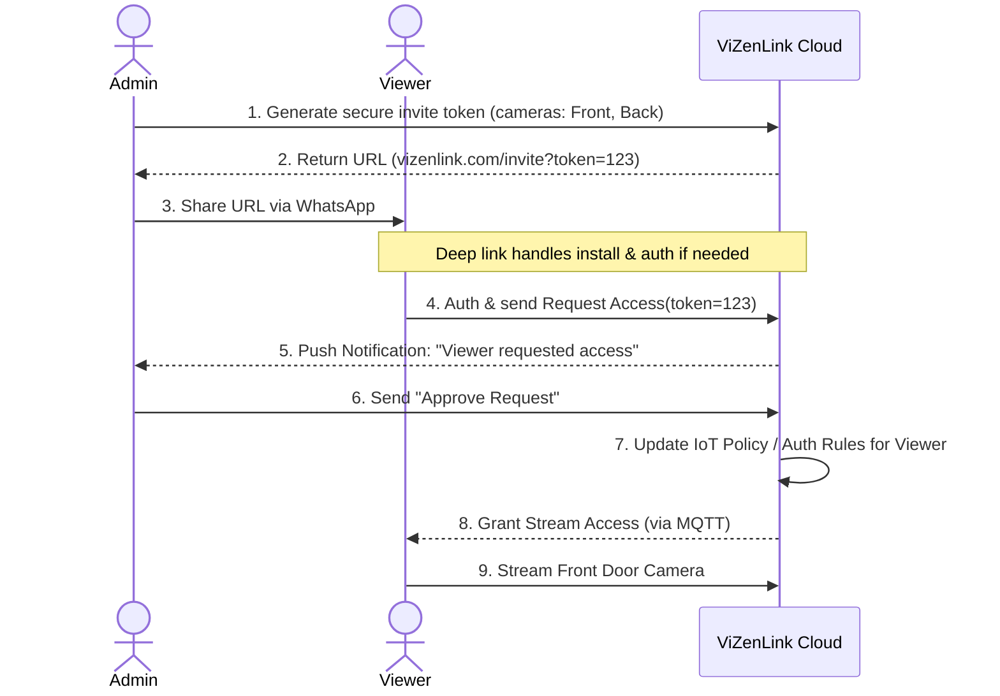

# ViZenLink: Detailed Device Pairing & Link Sharing UX Specification

This document serves as the complete UX/UI and architectural specification for Device Pairing and the "Link + Approval" sharing method for the ViZenLink mobile app. It is intended for product managers, designers, and engineers.

---

## 1. Core Security Concept: "First to Pair = Absolute Admin"

To ensure enterprise-grade security within a consumer-friendly app, ViZenLink operates on a strict hardware-ownership model:

1.  **Claiming Ownership:** When a new camera is taken out of the box, the first user to pair it (via QR scan or Bluetooth) is permanently recorded in the ViZenLink Cloud as the **Admin**.
2.  **Hardware Lockout:** Once paired, the camera's serial number/MAC is cryptographically bound to the Admin's account. No one else can pair this camera, even if they physically reset it. The cloud will reject secondary pairing attempts.
3.  **Downward Flow:** Because the Admin owns the device, all secondary access (family, guests) *must* be initiated and approved by the Admin.

---

## 2. Permissions Matrix

Before designing the flow, we define what each role is legally allowed to do within the app.

| Feature | Admin (Owner) | Family Role | Guest Role (Live Only) |
| :--- | :---: | :---: | :---: |
| **View Live Stream** | ✅ | ✅ | ✅ |
| **Two-Way Audio (Talk)** | ✅ | ✅ | ❌ |
| **View Event History (Playback)**| ✅ | ✅ | ❌ |
| **Receive Push Notifications** | ✅ | ✅ | ✅ (Toggle local only) |
| **Change Motion Zones/AI Config**| ✅ | ❌ | ❌ |
| **Change Wi-Fi / Reboot** | ✅ | ❌ | ❌ |
| **Format SD Card / Delete Video**| ✅ | ❌ | ❌ |
| **Invite/Revoke Other Users** | ✅ | ❌ | ❌ |
| **Remove/Transfer Camera** | ✅ | ❌ | ❌ |

---

## 3. The "Option B" Sharing Flow (Link + Final Approval)

Instead of forcing the Admin to manually type an email address, we use a low-friction, high-security flow using a shareable link combined with an explicit Admin approval step.

### Flow Sequence:
1.  **Admin:** Generates a unique sharing link in the app (valid for 24 hours) and sends it via WhatsApp.
2.  **Viewer:** Clicks the link. (If app is not installed, they are routed to App Store. Post-install, deep linking remembers the token).
3.  **Viewer:** Logs in/Signs up, and taps "Request Access".
4.  **Admin:** Receives a push notification that the Viewer has requested access and taps "Approve."
5.  **Viewer:** The camera instantly appears on their dashboard.

---

## 4. UI Wireframes & Flow: Admin Point of View

### Screen 1: Admin Generating the Link
*Admin navigates to Account Settings > Family & Sharing.*

```text
+-------------------------------------------------+
| < Back            Family & Sharing              |
+-------------------------------------------------+
|                                                 |
|  Select Cameras to Share:                       |
|  [x] Front Door Camera                          |
|  [x] Backyard Camera                            |
|                                                 |
|  Permission Role:                               |
|  (o) Family (View Live, Talk, View History)     |
|  ( ) Guest  (View Live Only)                    |
|                                                 |
|  +-------------------------------------------+  |
|  |  [Icon] Create WhatsApp / SMS Invite Link |  | <-- Admin taps here
|  +-------------------------------------------+  |
|  *Link expires in 24 hours.*                    |
|                                                 |
|  Active Users (1)                               |
|  [Icon] wife@example.com   [Manage]             |
|                                                 |
+-------------------------------------------------+
```

### Screen 2: Admin Receiving the Approval Request
*After the Viewer requests access, the Admin gets an actionable prompt.*

```text
+-------------------------------------------------+
| = Menu               Dashboard                  |
+-------------------------------------------------+
|                                                 |
|  > [!IMPORTANT] Access Request                  |
|  ---------------------------------------------  |
|  User 'johndoe@email.com' clicked your invite   |
|  link and is requesting access to:              |
|  - Front Door Camera                            |
|  - Backyard Camera                              |
|                                                 |
|       [ Deny Request ]      [ Grant Access ]    | <-- Admin clicks Grant
|  ---------------------------------------------  |
|                                                 |
|  [ FRONT DOOR CAMERA STREAM ]                   |
+-------------------------------------------------+
```

---

## 5. UI Wireframes & Flow: Viewer Point of View

### Screen 3: Viewer Requesting Access
*Viewer clicks the WhatsApp link, authenticates, and is presented with this screen.*

```text
+-------------------------------------------------+
|               Pending Invitation                |
+-------------------------------------------------+
|                                                 |
|               [ Camera Icon ]                   |
|                                                 |
|  You have been invited by HomeOwner to access   |
|  their ViZenLink cameras.                       |
|                                                 |
|  Cameras included:                              |
|  - Front Door Camera                            |
|  - Backyard Camera                              |
|                                                 |
|  Role: Family Member                            |
|                                                 |
|  +-------------------------------------------+  |
|  |             Request Access                |  | <-- Viewer taps here
|  +-------------------------------------------+  |
|                                                 |
|  *The owner must approve your request before    |
|  you can view the streams.*                     |
+-------------------------------------------------+
```

### Screen 4: Viewer's Restricted Dashboard
*Once approved, the Viewer sees the live streams. Note the lack of "Settings" or "Delete" capabilities.*

```text
+-------------------------------------------------+
| = Menu               My Cameras                 |
+-------------------------------------------------+
|                                                 |
|  Shared with me (Owner: HomeOwner)              |
|                                                 |
|  +-------------------------------------------+  |
|  |                [ LIVE ]                   |  |
|  |           Front Door Camera               |  |
|  |  [ Audio: On ]             [ Talk: Hold ] |  |
|  +-------------------------------------------+  |
|                                                 |
|  [ View Event History ]                         |
|                                                 |
|  *Camera settings are managed by the owner*     |
+-------------------------------------------------+
```

---

## 6. Edge Cases & Error States

### 1. The Deep Linking Challenge (App not installed)
**Scenario:** Viewer clicks the WhatsApp link but doesn't have the ViZenLink app.
**Solution:** The link uses Firebase Dynamic Links (or Apple Universal Links / Android App Links). 
1. It redirects them to the App Store/Play Store.
2. After downloading and opening the app for the first time, the app retrieves the original `invite_token` from the OS.
3. The app prompts them to "Sign Up", and immediately routes them to **Screen 3** (Request Access) after account creation.

### 2. Link Expiration
**Scenario:** The Viewer clicks a WhatsApp link that is older than 24 hours.
**UI Display:** A screen showing a broken link icon with the text: *"This invitation link has expired for security reasons. Please ask the camera owner to generate a new link."*

### 3. Admin Denies Request
**Scenario:** The Admin clicks "Deny Request" on Screen 2.
**UI Display:** The Viewer's app immediately updates (via MQTT/WebSocket) from the "Pending..." state to: *"Your request to access these cameras was declined by the owner."*

---

## 7. Revocation & Device Transfer Flows

### Revoking Access (Admin Action)
The Admin can revoke access instantly. 
1. Admin navigates to `Family & Sharing` -> taps `Manage` next to the user -> taps `Revoke Access`.
2. **Viewer Experience:** If the Viewer is currently watching the live stream, the WebSocket connection is immediately terminated. The screen goes black, kicks them back to the Dashboard, and the shared cameras disappear from their list entirely.

### Device Transfer / Factory Reset (Admin Action)
If the Admin moves out and leaves the cameras for a new homeowner, they must release the hardware lock.
1. Admin goes to `Camera Settings` -> `Remove Device`.
2. **Backend Action:** The ViZenLink cloud deletes the cryptographic binding between the Admin and the serial number.
3. **Result:** The camera reboots into "Pairing Mode" (LED flashing). It can now be claimed by a brand new Admin. *Note: Doing this automatically revokes all shared Viewer access as well.*

---

## 8. Technical Sequence Diagram


